<!-- Assets are generated: edit scripts/generate.py, then run `python3 scripts/generate.py` -->

<a href="https://ali-shamsi-dev.netlify.app/">
  
</a>

  

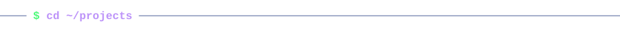

  <a href="https://github.com/PaddlePal"></a>
  <a href="https://github.com/SteadyScript/SteadyScript"></a>

  <a href="https://github.com/Ali-Aryo/portfolio-website-III"></a>
  <a href="https://github.com/Ali-Aryo/PhishNet.AI"></a>

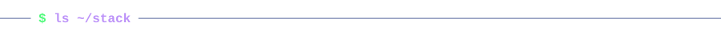


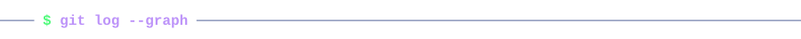

<picture>
  <source media="(prefers-color-scheme: dark)" srcset="https://raw.githubusercontent.com/Ali-Aryo/Ali-Aryo/output/snake-dark.svg" />
  <source media="(prefers-color-scheme: light)" srcset="https://raw.githubusercontent.com/Ali-Aryo/Ali-Aryo/output/snake-light.svg" />
  
</picture>

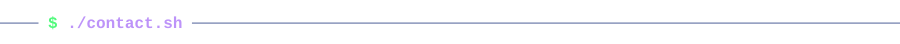

  
  
  
  

 

  
<code>$ brew install coffee</code>

   
  

